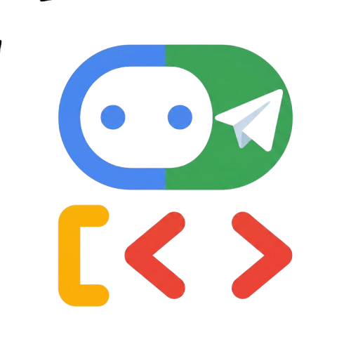

<p align="center">
  
</p>

<h1 align="center">ADK Connectors</h1>

<p align="center">
  <a href="https://opensource.org/licenses/MIT"></a>
  <a href="https://www.python.org"></a>
  <a href="https://pypi.org/project/adk-connector/"></a>
  <a href="https://www.npmjs.com/package/adk-connector-js"></a>
  <a href="https://nodejs.org"></a>
</p>

**ADK Connectors** is a plug-and-play toolkit that wraps any [Google Agent Development Kit (ADK)](https://github.com/google/adk) agent and exposes it as a chatbot on Telegram, Discord, WhatsApp, and Slack. 

By adding just a few lines of code, you can bridge the gap between local development, testing, and production messaging platforms.

---

## 🎥 Setup Demo: `adk-connector` with the `blog-writer` Agent

Below is a walkthrough showing how to set up the [`adk-connector`](https://pypi.org/project/adk-connector/) Python package in the official [`blog-writer`](https://github.com/google/adk-samples/tree/main/python/agents/blog-writer) example project:

[https://github.com/Harshk133/adk-connector/raw/main/assets/adk-connector-demo.mov](https://github.com/user-attachments/assets/e19ded5d-fcca-4f17-b0e4-390d95c7c4dd)

*(If the video does not load or play automatically, you can view the file directly at [assets/adk-connector-demo.mov](assets/adk-connector-demo.mov).)*

---

## ✨ Key Features

* 🚀 **3-Line Wrapper**: Deploy any `google-adk` agent (Python or JavaScript/TypeScript) to messaging channels with virtually zero code changes.
* 🔄 **Cross-Device Session Sync**: Sync conversations seamlessly. Chat on Telegram or Discord, then inspect and continue the exact same conversation inside the ADK Web UI (`adk web`).
* 💾 **Automatic Database Engine Setup**: Transparently spins up an asynchronous SQLite backend to record session states, events, and tool invocations.
* 🔒 **Local Persistent Mapping**: Uses a secure, local JSON mapping engine so restarting the bot never breaks session IDs or active chats.
* 🧩 **Extensible Architecture**: Structured to support multiple providers (Telegram, Discord, and future modules for WhatsApp and Slack).

---

## 📦 Installation

This repository contains connectors for both **Python** and **JavaScript / TypeScript**.

### 🐍 Python (`adk-connector`)
```bash
pip install adk-connector
```
For database-backed cross-device session synchronization (e.g. `adk web` UI), install the DB components:
```bash
pip install "google-adk[db]"
```

### 🟨 JavaScript / TypeScript (`adk-connector-js`)
```bash
npm install adk-connector-js
# or
pnpm install adk-connector-js
```

---

## ⚙️ Environment Configuration

Create a `.env` file in your project root and configure the required environment variables:

```env
# Required for agent reasoning
GEMINI_API_KEY=your_gemini_api_key_here

# Required for Telegram bot
TELEGRAM_BOT_TOKEN=your_telegram_bot_token_here
TELEGRAM_USER_ID=your_telegram_user_id_here

# Required for Discord bot
DISCORD_BOT_TOKEN=your_discord_bot_token_here
DISCORD_USER_ID=your_discord_user_id_here
```

---

## ⚡ Quick Start: Python vs JS/TS

### 🐍 Python Quick Start (Telegram)

#### 1. Write the code (`agent.py`)
```python
import os
from dotenv import load_dotenv
from google.adk.agents.llm_agent import Agent
from adk_connectors.telegram import TelegramConnector

# Load environment variables from .env
load_dotenv()

# 1. Define your standard Google ADK Agent
assistant = Agent(
    model='gemini-2.5-flash',
    name='my_assistant',
    instruction='You are a helpful assistant.'
)

if __name__ == "__main__":
    # 2. Retrieve your Telegram Bot Token
    token = os.getenv("TELEGRAM_BOT_TOKEN")
    
    # 3. Bind the connector
    connector = TelegramConnector(
        token=token,
        agent=assistant
    )
    
    # 4. Start polling!
    connector.start()
```

#### 2. Run the Script
```bash
python agent.py
```

### 🐍 Python Quick Start (Discord)

#### 1. Write the code (`agent.py`)
```python
import os
from dotenv import load_dotenv
from google.adk.agents.llm_agent import Agent
from adk_connectors.discord import DiscordConnector

# Load environment variables from .env
load_dotenv()

# 1. Define your standard Google ADK Agent
assistant = Agent(
    model='gemini-2.5-flash',
    name='my_assistant',
    instruction='You are a helpful assistant.'
)

if __name__ == "__main__":
    # 2. Retrieve your Discord Bot Token
    token = os.getenv("DISCORD_BOT_TOKEN")
    
    # 3. Bind the connector
    connector = DiscordConnector(
        token=token,
        agent=assistant
    )
    
    # 4. Start the bot!
    connector.start()
```

#### 2. Run the Script
```bash
python agent.py
```

### 🟨 JavaScript / TypeScript Quick Start

#### 1. Write the code (`agent.ts`)
```typescript
import { LlmAgent } from '@google/adk';
import { TelegramConnector } from 'adk-connector-js';
import dotenv from 'dotenv';

// Load environment variables (.env)
dotenv.config();

// 1. Define your standard Google ADK Agent
export const rootAgent = new LlmAgent({
  name: 'my_assistant',
  model: 'gemini-2.5-flash',
  instruction: 'You are a helpful assistant.'
});

// 2. Launch the Telegram Connector under script entrypoint
if (import.meta.url === `file://${process.argv[1]}` || process.argv[1]?.endsWith('agent.ts')) {
  const connector = new TelegramConnector({
    token: process.env.TELEGRAM_BOT_TOKEN!,
    agent: rootAgent
  });

  connector.start();
}
```

#### 2. Run the Script
```bash
npx tsx agent.ts
```

---

## 🔄 Python Advanced Setup: Session Synchronization (with `adk web`)

The advanced setup enables the unified cross-device sync engine so you can chat with your bot on Telegram or Discord, and view, inspect, or continue the exact same conversation inside the local **ADK Web UI** (`adk web`).

### 1. Configure the Connector
Set `session_management_across_device=True` and pass your personal user ID to `dev_user_id`. This automatically maps your chats to the `"user"` namespace in `adk web`:

```python
# For Telegram Setup:
connector = TelegramConnector(
    token=token,
    agent=assistant,
    session_management_across_device=True,
    dev_user_id=os.getenv("TELEGRAM_USER_ID")
)

# For Discord Setup:
connector = DiscordConnector(
    token=token,
    agent=assistant,
    session_management_across_device=True,
    dev_user_id=os.getenv("DISCORD_USER_ID")
)
```

### 2. Run the Bot & Web Server
You can run this using your configured agent workspace:

1. **Launch the Bot**:
   Run the agent script:
   ```bash
   python my_agent/agent.py
   ```
2. **Launch the ADK Web Server** in a separate terminal:
   ```bash
   adk web my_agent
   ```
3. Open your browser and navigate to `http://127.0.0.1:8000`. Your conversation history and tool executions will appear in the sidebar session list. You can seamlessly chat from either your messaging client (Telegram/Discord) or the Web UI!

---

## 🤖 Multi-Agent & Sub-Agent Support

`adk-connector` is built out-of-the-box to support complex agents that delegate tasks to sub-agents (e.g. using `sub_agents=[...]` or `tools=[AgentTool(agent=...)]`).

### 1. Zero Extra Launcher Files Required
You can integrate `adk-connector` directly inside your main `agent.py` file under `if __name__ == "__main__":`. There is no need to write a separate script like `run_telegram.py`. 

### 2. Auto-Resolution of Missing State Variables
In multi-agent setups, sub-agents often expect prompt context variables (e.g., `{seminal_paper}`) that get populated by parent outputs from previous turns. If a user triggers a tool in a single-turn or text-only scenario, these variables won't exist in the session state yet.
`adk-connector` automatically scans all parent and sub-agent instructions for curly brace placeholders and pre-populates them dynamically with user input or fallback values before executing the runner. This **prevents `KeyError: 'Context variable not found'` crashes**.

### 3. Double-Import Safety
Running multi-agent code directly as a script (`python -m package.module`) often triggers Python double-import cycles if the package initialization files import the agent submodule. When an ADK agent is instantiated twice in this cycle, Pydantic throws a validation error because sub-agents are assigned a parent twice. 
`adk-connector` automatically overrides ADK parent-validation checks to allow safe duplicate parent resolution under import cycles, guaranteeing that **your code runs correctly out of the box**.

---

## 🗺️ Roadmap

- [x] **Telegram Connector** (v0.1.0)
- [x] **Discord Connector** (v0.2.2)
- [ ] **WhatsApp Connector** (Planned)
- [ ] **Slack Connector** (Planned)

---

## 📄 License

This project is licensed under the MIT License - see the [LICENSE](LICENSE) file for details.
